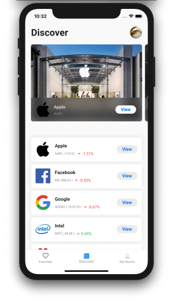
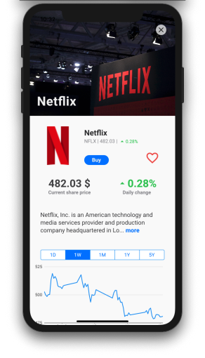

# Stocker
> a simple stock exchange cross-platform app

[Try it Out](https://auth-test-a84a0.web.app)

## Table of contents
* [General info](#general-info)
* [Screenshots](#screenshots)
* [Technologies](#technologies)
* [Features](#features)
* [Contact](#contact)

## General info
This project was inspired both by my curiosity and my lack of knowledge when it comes to stock exchange. I found that a nice way to learn a bit about it was to build a simple app.
The goal was to simplify stock marketing as much as possible - no complicated graphics, not alot of numbers and overwhelming amounts of raw data.
The users should be able to be comfortable to do as they wish, and learn from their mistakes on the go.

[App Summary](docs/Stocker.pdf)

## Screenshots

## Technologies
* Flutter - version 1.20

## Features
List of features ready and TODOs for future development
* Discover trending stock companies
* Get stock price data for up to the last 5 years
* Buy and Sell stocks
* Add stocks to a watchlist
* Watch your stock portfolio and account value history

To-do list:
* Add stock searching functionality

## Status
Project is: _in progress_.

### Contact
samuel.arbibe@gmail.com
